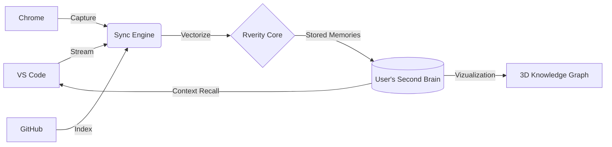

<div align="center">
  <br />
  <a href="https://rverity.ai">
    <!-- Replace with actual logo URL when hosted -->
    
  </a>
  <br />

  <h1>RVERITY</h1>
  
  <p align="center">
    <b>The Knowledge Graph for your Digital Soul.</b>
  </p>

  <p align="center">
    <a href="https://rverity.ai">Live Demo</a> •
    <a href="#-getting-started">Getting Started</a> •
    <a href="#-the-manifesto">The Manifesto</a> •
    <a href="#-community">Community</a>
  </p>
  
  <br />
</div>

---

> *"AI models are generic geniuses. They know everything about the world, but nothing about YOU. Rverity bridges that gap."*

## 🔮 The Problem
You spend 40% of your life as a developer **searching**.
- Searching for that snippet you wrote 3 months ago.
- Searching for the docs you read last week.
- Searching for the Jira ticket that explains *why* this code exists.

Your digital life is fragmented across VS Code, Chrome, GitHub, and Slack. **You are leaking context every second.**

## ⚡ The Solution: Rverity
Rverity is not just a tool. It is a **Protocol**.
It acts as a background "Neural Layer" that silently observes, indexes, and connects your digital footprint into a massive, 3D Knowledge Graph.

It turns your scattered history into **Absolute Truth**.

### How It Works


1.  **Capture**: Our plugins (VS Code Extension, Chrome Extension) listen to your workflow.
2.  **Synthesize**: Code, docs, and notes are vectorized and linked in real-time.
3.  **Recall**: When you open a file, Rverity *instantly* shows you every related memory, doc, or bug report from your past.

## 🛠️ The Tech Stack (Built for Speed)
This isn't a wrapper. This is deep-tech.
-   **Frontend**: Next.js 16 (App Router), Framer Motion, React Three Fiber (3D).
-   **Backend**: Serverless Edge Functions (Vercel).
-   **Memory**: Supabase (pgvector) + Upstash Redis (Hot Cache).
-   **Intelligence**: OpenAI / Anthropic Embeddings.

## 🚀 Getting Started

We are open-source at heart. Run your own brain.

### Prerequisites
- Node.js 20+
- Supabase Account
- Upstash Redis Account

### Installation

```bash
# 1. Clone the repository
git clone https://github.com/Ramrajnagar/Rverity.git
cd neurosync-ai

# 2. Install dependencies (Monorepo)
npm install

# 3. Configure Environment
cp apps/web/.env.example apps/web/.env.local
# (Fill in your SUPABASE_URL, ANON_KEY, and UPSTASH_REDIS_REST_URL)

# 4. Ignite the Engine
npm run dev
```

Visit `http://localhost:3000` and watch your brain come to life.

## 🤝 Contributors
We are building the future of human-AI symbiosis. We need **Architects**, not just coders.

<div align="center">
  <a href="https://github.com/Ramrajnagar/Rverity/graphs/contributors">
    
  </a>
</div>

**Areas we need help with:**
- [ ] **Neural Visualizations**: Make the 3D graph even more immersive.
- [ ] **IDE Agents**: Build the "Pre-Cognitive" context suggestions.
- [ ] **Privacy Vaults**: Local-first vector storage.

## 📜 The Philosophy
We believe in **Data Sovereignty**.
Rverity is designed to be self-hosted. Your thoughts, your code, and your memories belong to **you**. We just build the lens to see them.

---

<p align="center">
  Built with obsession by <a href="https://github.com/Ramrajnagar">Ramraj</a> and the Rverity Team.
</p>
