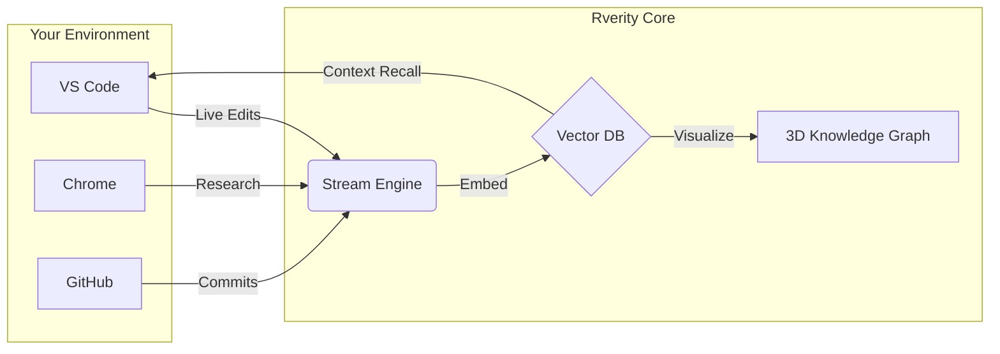

<div align="center">
  <a href="https://rverity.ai">
    
  </a>

  <h1>RVERITY</h1>

  <p align="center">
    <strong>The Absolute Truth for your Digital Life.</strong>
  </p>
  
  <p align="center">
    A self-hosted <b>Knowledge Graph</b> that syncs your code, research, and context into a single, queryable Second Brain.
  </p>

  <p align="center">
    <a href="https://rverity.ai">Live Demo</a> •
    <a href="#-getting-started">Getting Started</a> •
    <a href="#-the-manifesto">Manifesto</a> •
    <a href="#-community">Community</a>
  </p>
</div>

<br/>

---

## The Manifesto
AI models are generic geniuses. They know everything about the world, but **nothing about YOU**.

We believe that in the post-AGI world, **Context is the new Currency**.
Your browsing history, your git commits, your Slack messages—these aren't just logs. They are the fingerprints of your digital soul.

**Rverity** is the infrastructure that reclaims this data. We don't just "search" your history. We vector-embed it, link it in a 3D graph, and give you (and your AI agents) instant access to your **Absolute Truth**.

> *"Stop searching. Start recalling."*

---

## The Workflow
Rverity runs silently in the background, weaving connections between your isolated tools.



1.  **Observe**: Our plugins capture context from VS Code, Chrome, and GitHub.
2.  **Synthesize**: We turn raw data into semantic vectors.
3.  **Recall**: When you open a file, Rverity instantly anticipates what you need to know next.

---

## Tech Stack
Built for speed, privacy, and sovereignty.

*   **Frontend**: Next.js 16 (App Router), React Three Fiber (3D), Framer Motion.
*   **Backend**: Node.js (Edge Functions), WebSockets.
*   **Database**: Supabase (PostgreSQL + pgvector).
*   **Cache**: Upstash Redis.
*   **Intelligence**: OpenAI / Anthropic Embeddings.

---

## Getting Started

Rverity is open-source. You can self-host your own brain today.

### Prerequisites
*   Node.js 20+
*   Docker (optional)
*   Supabase & Upstash accounts

### Installation

```bash
# 1. Clone the Protocol
git clone https://github.com/Ramrajnagar/Rverity.git
cd neurosync-ai

# 2. Install Dependencies
npm install

# 3. Configure Keys
cp apps/web/.env.example apps/web/.env.local
# Add your NEXT_PUBLIC_SUPABASE_URL, ANON_KEY, and REDIS_URL

# 4. Initialize
npm run dev
```

Visit `http://localhost:3000` to enter the graph.

---

## Community & Contributors
We are building the memory layer for the future of AI. We need architects, visionaries, and builders.

<a href="https://github.com/Ramrajnagar/Rverity/graphs/contributors">
  
</a>

**Roadmap Priorities:**
*   [ ] **Neural Visualizations**: Immersive WebGL graph navigation.
*   [ ] **Predictive Context**: Agents that code *with* you, not just for you.
*   [ ] **Local Vaults**: Fully offline, local-only vector storage.

---

<div align="center">
  <p>Built with conviction by <a href="https://github.com/Ramrajnagar">Ramraj</a> and the Rverity Team.</p>
</div>
